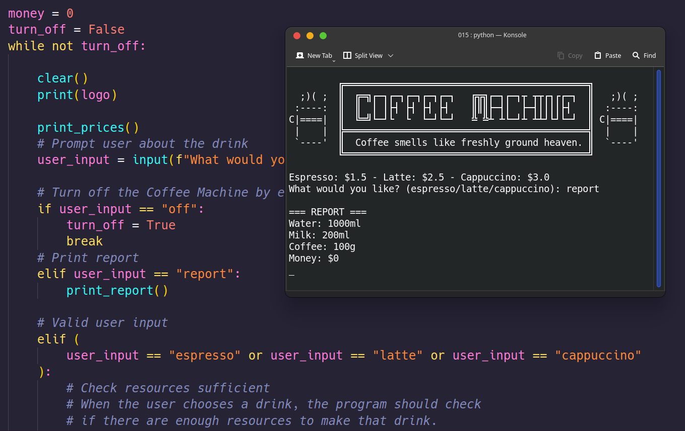

# Day 15 - The Coffee Machine

## Task list

- Prompt user by asking "​What would you like? (espresso/latte/cappuccino):​"
- Turn off the Coffee Machine by entering "​off" to the prompt.
- Print report by entering "report" to the prompt.
- Check resources sufficient?
- Process coins.
- Check transaction successful?
- Make Coffee.
