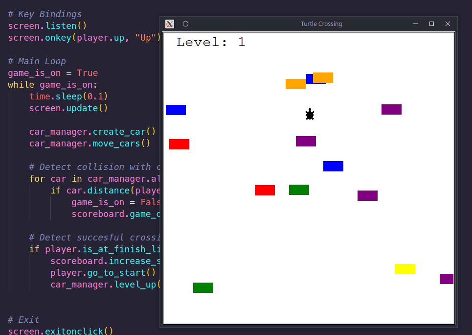

# Day 23 - The Turtle Crossing

## Task list

1. Move the turtle with keypress
2. Create and Move the cars
3. Detect collision with the car
4. Detect when the turtle reaches the other side
5. Create a scoreboard
