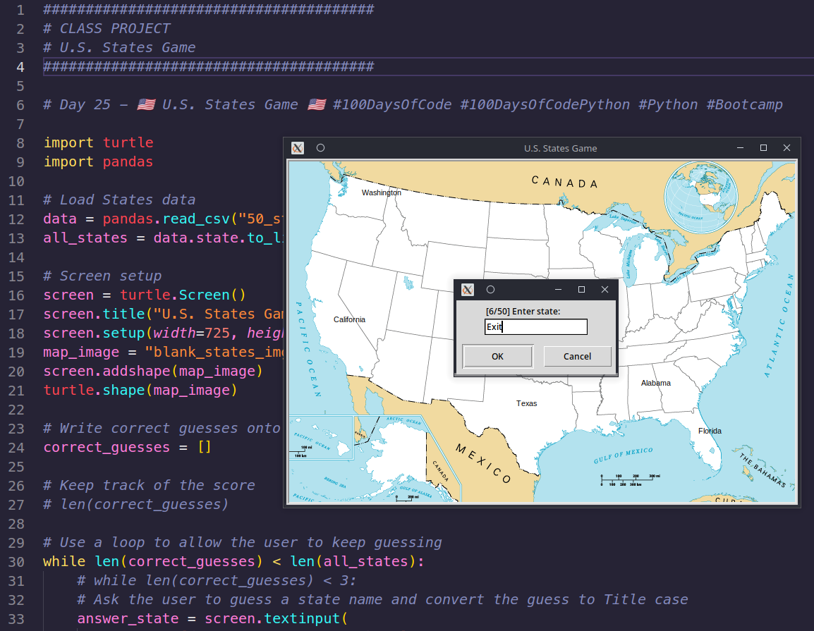

# Day 25 - U.S. States Game

## Task list

- Screen setup
- Ask the user to guess a state name and convert the guess to Title case
- Check if the guess is among 50 states
- Write correct guesses onto the map
- Use a loop to allow the user to keep guessing
- Keep track of the score
- Record the correct guesses in a list
