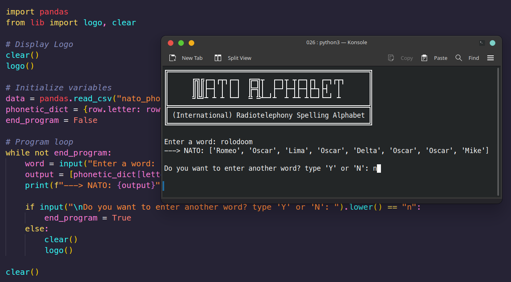

# Day 26 - NATO Alphabet



## Task list

- List Comprehension

Works with lists, strings, range and tuples.

```python
new_list = [new_item for item in list]
letter_list = [letter for letter in string]
```

Using logic

```python
new_list = [new_item for item in list if test]
```

- Dictionary Comprehension

```python
new_dict = {new_key:new_value for item in list}
new_dict = {new_key:new_value for (key,value) in dict.items() if test}
```
